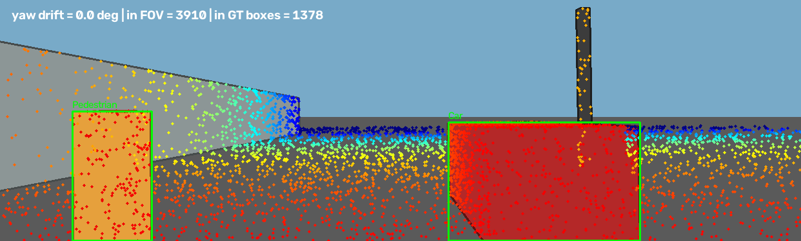
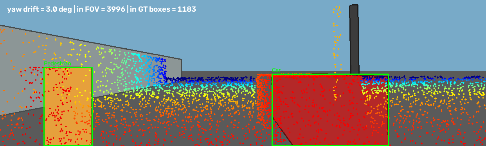

# Báo cáo Day 6: Độ nhạy projection LiDAR-camera với yaw drift

- **Họ tên:** Nguyễn Văn Chiến
- **MSSV:** 2A202602926
- **Lớp:** AI20K
- **Link repo:** https://github.com/nvchien19/K4-Track4-Day06-3D-From-Point-Clouds
- **Topic:** A — LiDAR-camera projection QA
- **Dataset:** `data/synthetic`, `data/kitti_mini`, `data/nuscenes_mini_subset`
- **Các frame đã dùng:** `000000` (benchmark); `000000` synthetic và `000011`, `000012`, `000015`, `000019` KITTI và `scene-0103_010` nuScenes (overlay demo)

## 1. Claim

Trên frame synthetic `000000`, yaw drift +3° làm tỷ lệ điểm chiếu nằm trong 2D GT boxes giảm 5.64 điểm phần trăm so với calibration gốc, trong khi tỷ lệ điểm còn nằm trong FOV đổi từ 16.339% thành 16.699%.

## 2. Evidence

| Yaw | Điểm trong ảnh | Điểm trong GT boxes | GT-box/projected |
|---:|---:|---:|---:|
| 0° | 3,910 (16.339%) | 1,378 | 35.243% |
| 0.5° | 3,928 (16.415%) | 1,328 | 33.809% |
| 1° | 3,935 (16.444%) | 1,296 | 32.935% |
| 2° | 3,956 (16.532%) | 1,213 | 30.662% |
| 3° | 3,996 (16.699%) | 1,183 | 29.605% |

Metric GT-box đếm điểm trong hợp các box 2D, có thể chứa điểm nền; đây là proxy alignment, không phải object recall. Benchmark chỉ dùng một frame synthetic, chưa suy rộng sang dữ liệu thật.

CSV: `results/yaw_perturb_sweep.csv`. Plot: `results/figures/yaw_perturb_sweep.png`. Overlay baseline: `results/figures/topic_a_overlay_000000.png`.
Các overlay KITTI thêm: `results/figures/overlay_000011_*.png`, `overlay_000012_*.png`, `overlay_000015_*.png`, và `overlay_000019_*.png`.



## 3. Failure case

Ở yaw drift +3°, điểm quanh vật thể không còn khớp với 2D box gốc; tỷ lệ GT-box giảm 5.64 điểm phần trăm (16.0% tương đối). Đây là lỗi **Geometry** do extrinsic bị perturb; thêm vào đó, chỉ số FOV là **Metric** yếu vì nó tăng nhẹ dù alignment xấu đi.



Với xe thật, theo dõi thêm edge/box alignment và cảnh báo theo xu hướng qua nhiều frame; không dùng riêng tỷ lệ điểm trong ảnh.

## 4. Khuyến nghị nếu triển khai thật

Trong ADAS, kiểm tra alignment sau va chạm hoặc bảo dưỡng giá đỡ cảm biến. Theo dõi tỷ lệ điểm trong vùng vật thể/edge, số điểm hợp lệ và độ ổn định qua thời gian; xác nhận trên nhiều cảnh KITTI/log thật trước khi chọn ngưỡng. Bước này rẻ hơn chạy detector, nhưng box label trong thử nghiệm synthetic không thay cho đánh giá an toàn ngoài đường.

## 5. Cách chạy lại

```bash
python -m pip install -r requirements.txt
python tools/verify_data.py --data-root data/kitti_mini
python tools/verify_data.py --data-root data/nuscenes_mini_subset
python -m starter.data_health --data-root data/synthetic
python -m starter.projection --data-root data/synthetic --frame 000000
python -m starter.projection --data-root data/kitti_mini --frame 000011
python -m starter.projection --data-root data/kitti_mini --frame 000012
python -m starter.projection --data-root data/kitti_mini --frame 000015
python -m starter.projection --data-root data/kitti_mini --frame 000019
python -m starter.projection --data-root data/nuscenes_mini_subset --frame scene-0103_010
python -m src.topic_a_calibration --data-root data/synthetic --frame 000000 --yaw-degs 0 0.5 1 2 3
```

## 6. Khai báo sử dụng AI

| Công cụ | Dùng cho việc gì | Bạn đã kiểm chứng thế nào |
|---|---|---|
| OpenAI Codex | Đọc README, cài hai hàm projection, tạo benchmark/plot và soạn báo cáo | Chạy kiểm tra hai bộ dữ liệu, known-point `(10,0,0)` cho `z≈9.727`, `(u,v)≈(613.964,175.007)`, chạy benchmark hai lần và so sánh CSV trước khi nộp |


### Thông tin lần chạy Colab

Notebook: `src/NguyenVanChien_2A202602926_TopicA_Colab.ipynb`. Phiên Colab: https://colab.research.google.com/drive/1WuaGwyuWvsXulxuhciu1QuzaEQ5xanPk. Metadata: `results/colab_run_metadata.json`. Học viên đã chạy notebook và tải kết quả; Codex đối chiếu SHA256 CSV của gói tải với metadata.

Python 3.13.16; NumPy 2.1.3; base commit `bce73adec3dbd09b2869ed2061513328ee228272`; CSV SHA256 `0f530d1ecf793a3ce3708597f9cb5245f8840652862b6b44c84cf9dc0966187c`.
